---
## Front matter
title: Лабораторная работа № 5. Дискреционное разграничение прав в Linux. Исследование влияния дополнительных атрибутов
author: [Радикорский Павел Михайлович, НФИбд-03-18]
institute: "RUDN University, Moscow, Russian Federation"
date: 13.11.2021
lang: "ru"
## Formatting
toc: false
slide_level: 2
theme: metropolis
mainfont: PT Serif
romanfont: PT Serif
sansfont: PT Sans
monofont: Consolas
header-includes:
 - \metroset{progressbar=frametitle,sectionpage=progressbar,numbering=fraction}
 - '\makeatletter'
 - '\beamer@ignorenonframefalse'
 - '\makeatother'
aspectratio: 43
section-titles: true

---
# Цели и задачи

## Цель

Изучение механизмов изменения идентификаторов, применения SetUID- и Sticky-битов. Получение практических навыков работы в консоли с дополнительными атрибутами. Рассмотрение работы механизма
смены идентификатора процессов пользователей, а также влияние бита Sticky на запись и удаление файлов

# Выполнение

## Процесс выполнения

Создали программу simpleid.c со следующим кодом
    
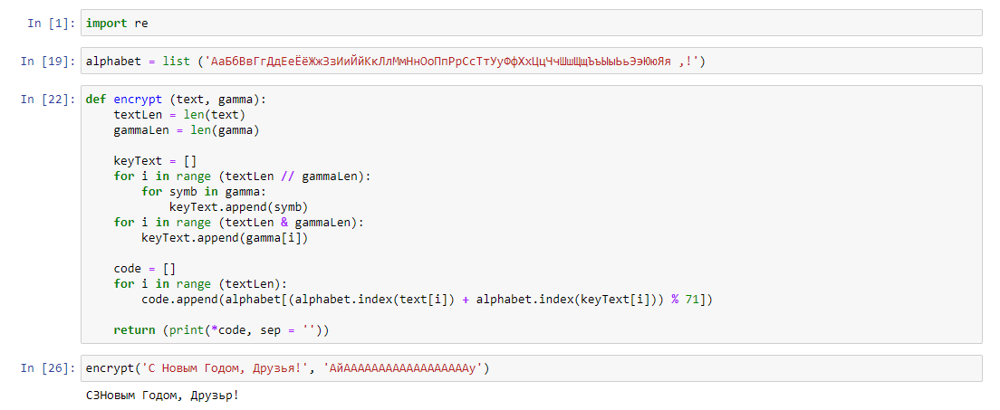{ #fig:001 width=70% }

## Процесс выполнения

Скомпилировали и выполнили программу. Рехультат совпал с командой id
    
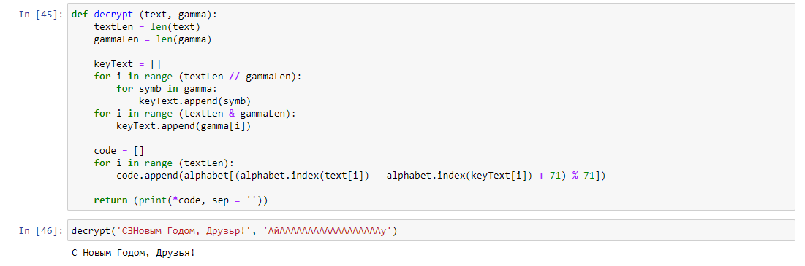{ #fig:001 width=70% }

## Процесс выполнения

Усложнили программу, добавив вывод действительных идентификаторов

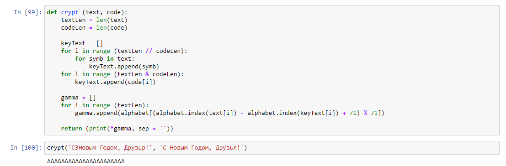{ #fig:001 width=70% }

## Процесс выполнения

Скомпилировали и выполнили программу

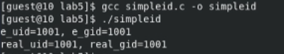{ #fig:001 width=70% }

## Процесс выполнения

От имени суперпользователя выполнили команды

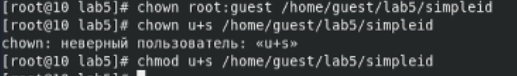{ #fig:001 width=70% }

## Процесс выполнения

Выполнили проверку правильности установки новых атрибутов и смены владельца файла simpleid

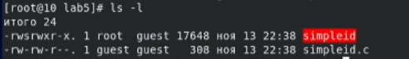{ #fig:001 width=70% }

## Процесс выполнения

Запустили simpleid, результат e_uid изменился. При смене SetGod-бита получили аналогичный результат

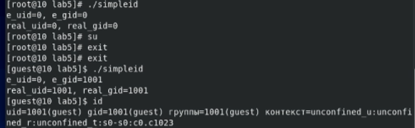{ #fig:001 width=70% }

## Процесс выполнения

Создали программу readfile.c со следующим кодом

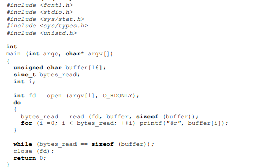{ #fig:001 width=70% }

## Процесс выполнения

Сменили владельца у файла readfile.c и изменили права так, чтобы только суперпользователь (root) мог прочитать его, a guest не мог

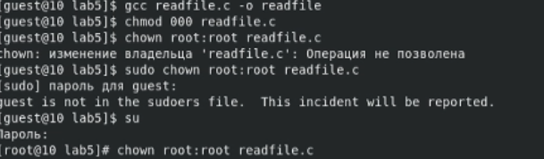{ #fig:001 width=70% }

## Процесс выполнения

Попробавали прочитать, записать и удалить файл от имени guest2, удалить не получилось

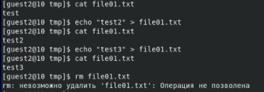{ #fig:001 width=70% }

## Процесс выполнения

Сняли атрибут t, выполнили те же команды, в этот раз удаление произошло успешно

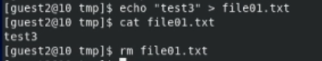{ #fig:001 width=70% }

# Выводы

В результате выполнения работы я изучил механизмы имеханизмов изменения идентификаторов, применения SetUID- и Sticky-битов