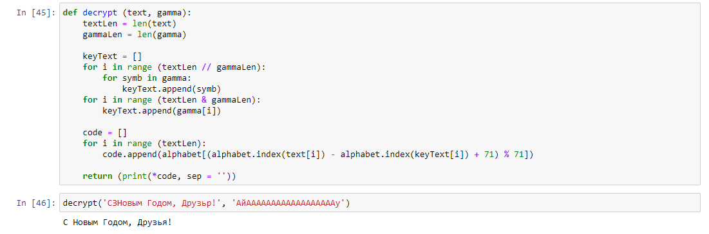

---
title: "Лабораторная работа № 5. Дискреционное разграничение прав в Linux. Исследование влияния дополнительных атрибутов"
author: [Радикорский Павел Михайлович, НФИбд-03-18]
institute: "RUDN University, Moscow, Russian Federation"
date: "13.11.2021"
keywords: [Безопасность, Лабораторная]
lang: "ru"
toc-title: "Содержание"
toc: true # Table of contents
toc_depth: 2
lof: true # List of figures
fontsize: 12pt
mainfont: PT Serif
romanfont: PT Serif
sansfont: PT Sans
monofont: Consolas
mainfontoptions: Ligatures=TeX
romanfontoptions: Ligatures=TeX
sansfontoptions: Ligatures=TeX,Scale=MatchLowercase
monofontoptions: Scale=MatchLowercase
titlepage: true
titlepage-text-color: "000000"
titlepage-rule-color: "000000"
titlepage-rule-height: 0
listings-no-page-break: true
indent: true
header-includes:
  - \usepackage{sectsty}
  - \sectionfont{\clearpage}
  - \linepenalty=10 # the penalty added to the badness of each line within a paragraph (no associated penalty node) Increasing the value makes tex try to have fewer lines in the paragraph.
  - \interlinepenalty=0 # value of the penalty (node) added after each line of a paragraph.
  - \hyphenpenalty=50 # the penalty for line breaking at an automatically inserted hyphen
  - \exhyphenpenalty=50 # the penalty for line breaking at an explicit hyphen
  - \binoppenalty=700 # the penalty for breaking a line at a binary operator
  - \relpenalty=500 # the penalty for breaking a line at a relation
  - \clubpenalty=150 # extra penalty for breaking after first line of a paragraph
  - \widowpenalty=150 # extra penalty for breaking before last line of a paragraph
  - \displaywidowpenalty=50 # extra penalty for breaking before last line before a display math
  - \brokenpenalty=100 # extra penalty for page breaking after a hyphenated line
  - \predisplaypenalty=10000 # penalty for breaking before a display
  - \postdisplaypenalty=0 # penalty for breaking after a display
  - \floatingpenalty = 20000 # penalty for splitting an insertion (can only be split footnote in standard LaTeX)
  - \raggedbottom # or \flushbottom
  - \usepackage{float} # keep figures where there are in the text
  - \floatplacement{figure}{H} # keep figures where there are in the text
...

# Цели и задачи

**Цель:** Изучение механизмов изменения идентификаторов, применения SetUID- и Sticky-битов. Получение практических навыков работы в консоли с дополнительными атрибутами. Рассмотрение работы механизма
смены идентификатора процессов пользователей, а также влияние бита Sticky на запись и удаление файлов

# Выполнение

Создали программу simpleid.c со следующим кодом
    
{ #fig:001 width=70% }

Скомпилировали и выполнили программу. Рехультат совпал с командой id
    
{ #fig:001 width=70% }

Усложнили программу, добавив вывод действительных идентификаторов

{ #fig:001 width=70% }

Скомпилировали и выполнили программу

{ #fig:001 width=70% }

От имени суперпользователя выполнили команды

{ #fig:001 width=70% }

Выполнили проверку правильности установки новых атрибутов и смены владельца файла simpleid

{ #fig:001 width=70% }

Запустили simpleid, результат e_uid изменился. При смене SetGod-бита получили аналогичный результат

{ #fig:001 width=70% }

Создайте программу readfile.c со следующим кодом

{ #fig:001 width=70% }

Сменили владельца у файла readfile.c и изменили права так, чтобы только суперпользователь (root) мог прочитать его, a guest не мог

{ #fig:001 width=70% }

Попробавали прочитать, записать и удалить файл от имени guest2, удалить не получилось

{ #fig:001 width=70% }

Сняли атрибут t, выполнили те же команды, в этот раз удаление произошло успешно

{ #fig:001 width=70% }

#  Выводы

В результате выполнения работы я изучил механизмы имеханизмов изменения идентификаторов, применения SetUID- и Sticky-битов