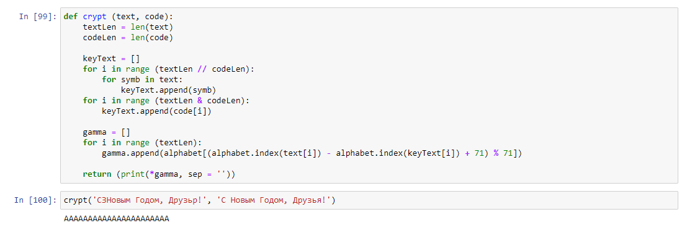

---
title: "Лабораторная работа № 7. Элементы криптографии. Однократное гаммирование"
author: [Радикорский Павел Михайлович, НФИбд-03-18]
institute: "RUDN University, Moscow, Russian Federation"
date: "11.12.2021"
keywords: [Безопасность, Лабораторная]
lang: "ru"
toc-title: "Содержание"
toc: true # Table of contents
toc_depth: 2
lof: true # List of figures
fontsize: 12pt
mainfont: PT Serif
romanfont: PT Serif
sansfont: PT Sans
monofont: Consolas
mainfontoptions: Ligatures=TeX
romanfontoptions: Ligatures=TeX
sansfontoptions: Ligatures=TeX,Scale=MatchLowercase
monofontoptions: Scale=MatchLowercase
titlepage: true
titlepage-text-color: "000000"
titlepage-rule-color: "000000"
titlepage-rule-height: 0
listings-no-page-break: true
indent: true
header-includes:
  - \usepackage{sectsty}
  - \sectionfont{\clearpage}
  - \linepenalty=10 # the penalty added to the badness of each line within a paragraph (no associated penalty node) Increasing the value makes tex try to have fewer lines in the paragraph.
  - \interlinepenalty=0 # value of the penalty (node) added after each line of a paragraph.
  - \hyphenpenalty=50 # the penalty for line breaking at an automatically inserted hyphen
  - \exhyphenpenalty=50 # the penalty for line breaking at an explicit hyphen
  - \binoppenalty=700 # the penalty for breaking a line at a binary operator
  - \relpenalty=500 # the penalty for breaking a line at a relation
  - \clubpenalty=150 # extra penalty for breaking after first line of a paragraph
  - \widowpenalty=150 # extra penalty for breaking before last line of a paragraph
  - \displaywidowpenalty=50 # extra penalty for breaking before last line before a display math
  - \brokenpenalty=100 # extra penalty for page breaking after a hyphenated line
  - \predisplaypenalty=10000 # penalty for breaking before a display
  - \postdisplaypenalty=0 # penalty for breaking after a display
  - \floatingpenalty = 20000 # penalty for splitting an insertion (can only be split footnote in standard LaTeX)
  - \raggedbottom # or \flushbottom
  - \usepackage{float} # keep figures where there are in the text
  - \floatplacement{figure}{H} # keep figures where there are in the text
...

# Цели и задачи

**Цель:** Освоить на практике применение режима однократного гаммирования

# Выполнение

Функция шифрования. Задаем алфавит из заглавных, строчных букв русского алфавита, !, ?, ., , и пробела. На вход поступает открытый текст, в виде массива символов, и ключ — гамму. Анализируем длину текста, «растягиваем» гамму до нужного размера и выполняем посимвольное сложение. 
    
{ #fig:001 width=70% }

Функция расшифрования Работает аналогично. «Растягиваем» гамму и выполняем посимвольное вычитание ее из текста. 
    
{ #fig:001 width=70% }

Функция, которая определяет ключ, с помощью которого шифротекст может быть преобразован в некоторый фрагмент текста, представляющий собой один из возможных вариантов прочтения открытого текста. Работает аналогично функции расшифрования, но на вход поступает не зашифрованный текст и ключ, а зашифрованный и открытый текст

{ #fig:001 width=70% }

#  Выводы

В результате выполнения работы я освоил на практике применение режима однократного гаммирования.